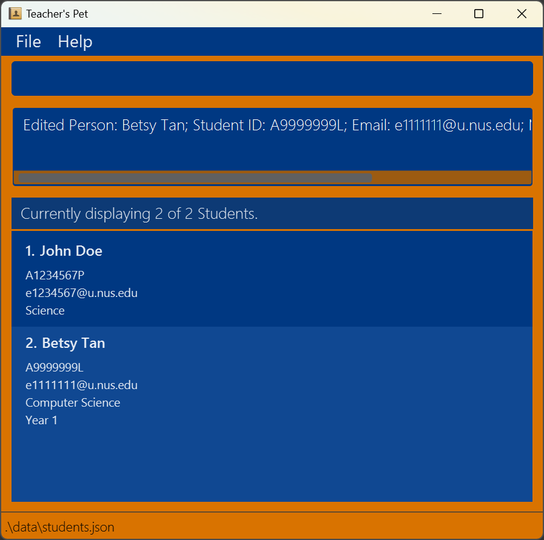
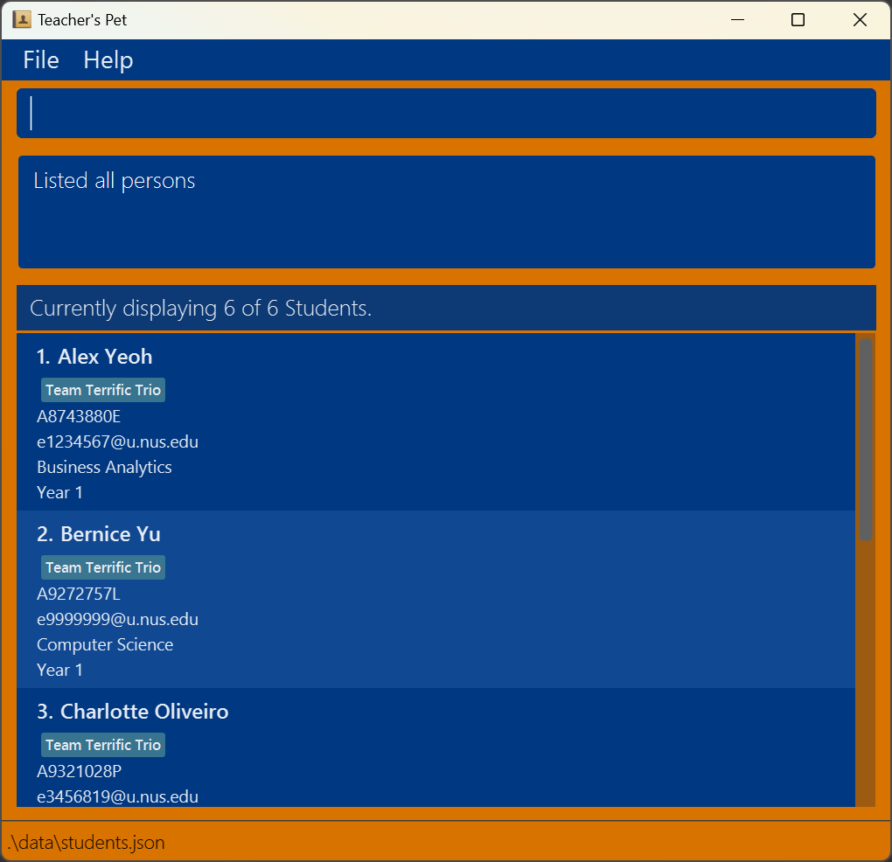
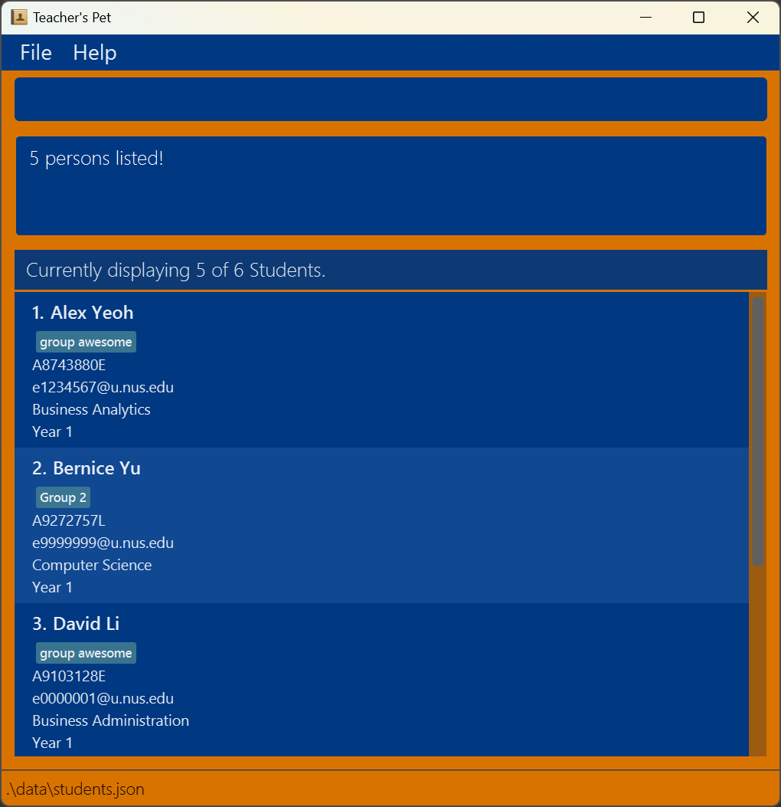
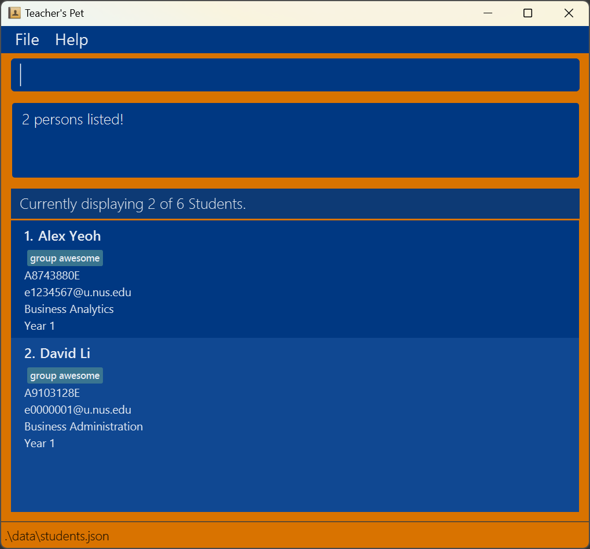
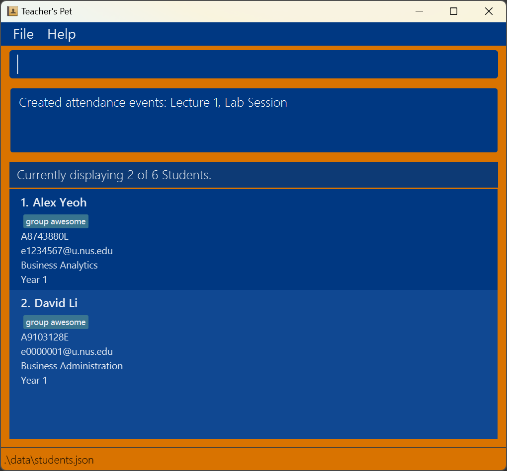
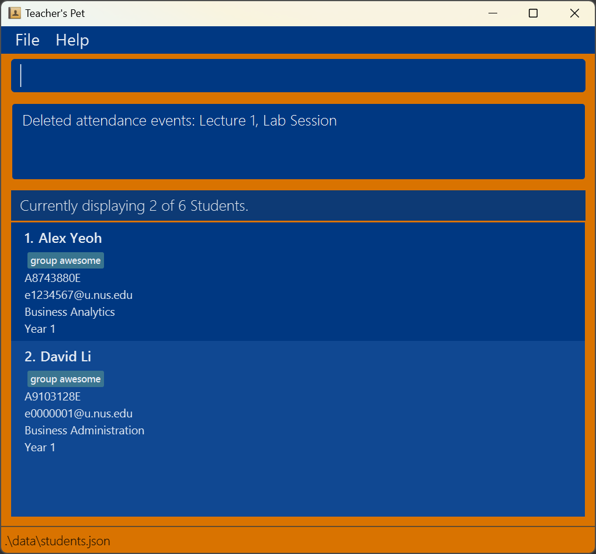
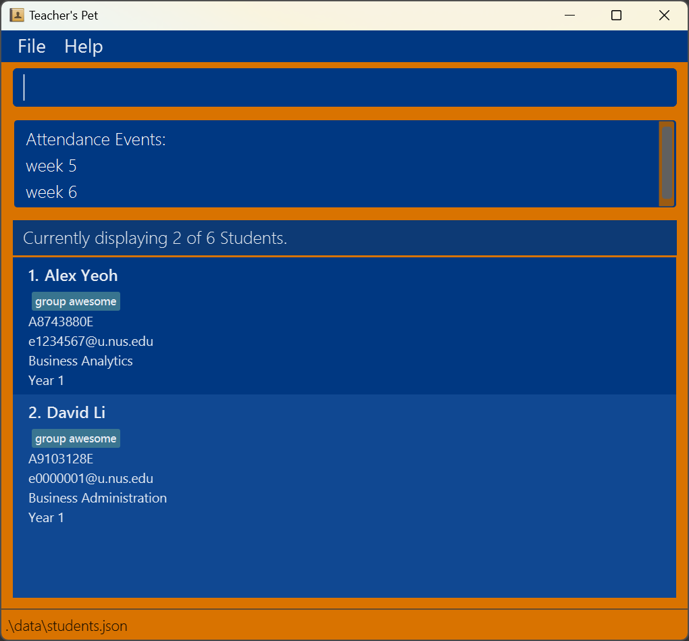
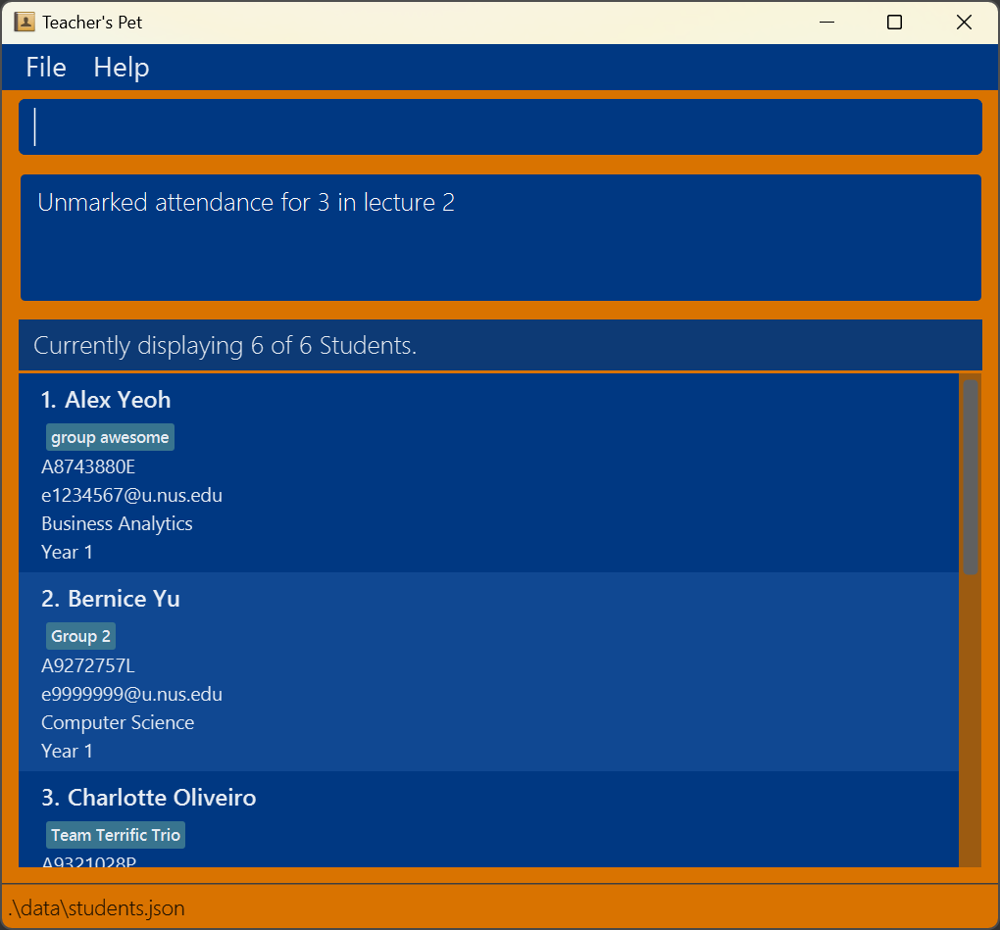
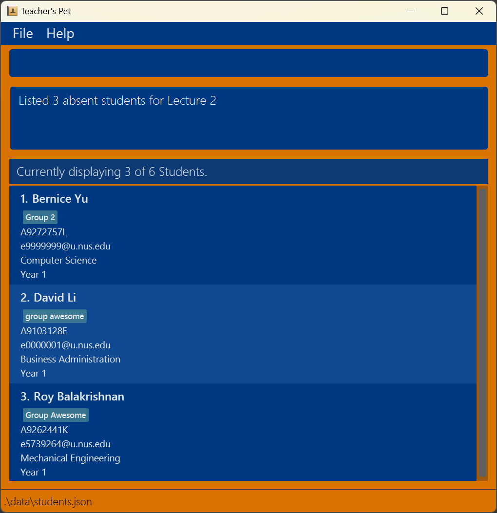

## Introduction 

Teacher's Pet is a **desktop app for managing students, tailored for Teaching Assistants (TA) in the National University of Singapore (NUS)**.
With Teacher's Pet, you can easily add, edit, delete, and view student information, as well as track their attendance, all using only your keyboard.
Teacher's Pet offers a lightweight, efficient solution optimized for small (<30 students) classes and works completely offline, promising performance even with an unstable network connection.

This user guide was designed to aid you in understanding how to use our product for your classroom needs.
We recommend you to read this guide in sequence. That being said, do not worry if this guide seems overwhelming. 
You can use our [Table of Contents](#table-of-contents) to navigate to different sections.

Our guide is structured as such:
1. **Quick Start:** A quick guide on how to download and start Teacher's Pet
2. **Commands:** An in-depth explanation on how to use our features
3. **Command Summary:** A quick summary of all our commands
3. **FAQ:** Answers to some common questions users have
4. **Known Issues:** A list of known issues

If you are new to Teacher's Pet, we recommend you to continue reading this guide sequentially (starting with [Quick Start](#quick-start)) to get a complete idea of how it works.

If you are already using Teacher's Pet, skipping to the [Commands](#commands) or [Command Summary](#command-summary) section may be more useful.

### How to navigate this user guide

Here are some symbols you may encounter in this user guide:

:bulb: **Tip:**
 This contains additional useful information

:information_source: **Information:**  
This contains some additional information

:exclamation: **Caution:**
This contains some important information that you should take note of

--------------------------------------------------------------------------------------------------------------------

### Table of Contents

* Table of Contents
{:toc}

--------------------------------------------------------------------------------------------------------------------

## Quick Start

You can refer to the [FAQ](#frequently-asked-questions-quick-start) section below for more information.

1. Ensure you have Java `17` or above installed in your Computer. You may download Java 17 through [this link](https://www.oracle.com/java/technologies/javase/jdk17-archive-downloads.html). 

2. Download the latest `teacherspet.jar` file from [here](https://github.com/AY2425S1-CS2103T-W10-1/tp/releases/tag/v1.5.1). The downloaded file should be  found in your  `Downloads` folder.

3. Copy the file, make an empty folder in your `Documents` folder and paste `teacherspet.jar` in the new folder.

4. Open a command terminal, enter `cd Documents/NAME_OF_YOUR_FOLDER`. Then, enter `java -jar teacherspet.jar` to run the application. 
   A window similar to the one below should appear in a few seconds. Note how the app contains some sample data. 

5. Type the command in the command box and press Enter to execute it. e.g. typing **`help`** and pressing Enter will open the help window. 
   Some example commands you can try:

   * `list` : Lists all students.

   * `add n/John Doe id/A1234567B nid/E1234567 m/Math y/2 g/group 1` : Adds a student named `John Doe` to the app.

   * `delete 3` : Deletes the 3rd student shown in the current list.

   * `clear` : Deletes all students.

   * `exit` : Exits the app.

6. Refer to [Commands](#commands) below for more details of each command. Alternatively, refer to [Command Summary](#command-summary) for a cheatsheet of commands and how to use them.

:bulb: **Tip:**
 If you want the app to be in another folder, you can copy the app to any folder you want. Just make sure to copy all files in the original folder (Not just the `teacherspet.jar` file).

### Frequently Asked Questions (Quick Start)

Back to [Quick Start](#quick-start)

**Q:** How do I check what version of Java I have on my device?   
**A:** You can refer to this [link](https://www.java.com/en/download/help/version_manual.html) for more information.

**Q:** I clicked the link to install Java 17, now which file should I download?  
**A:** You want to look for the file with `Installer` in its name for the Operating System of your device (eg. `macOS x64 DMG Installer` if you use an Apple device). After downloading the file, simply run it to install Java 17.

**Q:** How do I open a command terminal?  
**A:** If you are using a Windows device, search for `Windows PowerShell` or `Command Prompt`. If you are using a Mac/Apple device, search for `Terminal`.

**Q:** After running the app, some messages appear on my terminal, should I be concerned?  
**A:** If a window similar to the one in the image above appears, then the app is working well and you can safely ignore any messages on the terminal.

--------------------------------------------------------------------------------------------------------------------

## Commands

**:information_source: Information:** 

**Notes about the command format:**

* Words in `UPPER_CASE` are the parameters to be supplied by you. 
  e.g. in `add n/NAME`, `NAME` is a parameter which can be used as `add n/John Doe`.

* Items in square brackets are optional. 
  e.g `n/NAME [m/MAJOR]` can be used as `n/John Doe m/Business` or as `n/John Doe`.

* Parameters can be in any order. 
  e.g. if the command specifies `n/NAME id/NUS_STUDENTID`, `id/NUS_STUDENTID n/NAME` is also acceptable.
* The prefixes must be preceded by a space character. e.g. `add n/John Doe` is correct, but `addn/John Doe` is not.

* If you are using a PDF version of this document, be careful when copying and pasting commands that span multiple lines as space characters surrounding line-breaks may be omitted when copied over to the application.

### General Commands

#### Viewing help : `help`

Shows you a message containing a link to a more in depth user guide to help you!

Format: `help`

:bulb: **Tip:**
If you would prefer to see an offline brief overview help guide of all the commands, simply type in an
unknown command word and press enter.

---

#### Adding a student: `add`

You can add a student easily to Teacher's Pet!

Format: `add n/NAME id/NUS_STUDENTID [nid/NUS_NETID] [m/MAJOR] [y/YEAR] [g/GROUP_NAME]`

* The `NUS_STUDENTID` here refers to the NUS Matriculation Number of the student (Has the format 'AXXXXXXXC', where X is any number and C is any letter)
* The `NUS_NETID` here refers to the ID that is associated with the student's NUS Outlook account (Found in "NUS_NETID@u.nus.edu" and must be in the format 'eXXXXXXX', where X is any number)
* The `NUS_STUDENTID` must be unique (ie. Two students cannot have the same `NUS_STUDENTID`)

Here are some examples for you to try!
* `add n/John Doe id/A1234567P`
* `add n/Betsy Crowe m/Computer Science nid/e1111111 id/A9999999L y/1 g/Group 1`

---

#### Editing a student : `edit`

Need to change a student's details? You can edit an existing student in Teacher's Pet.

Format: `edit INDEX [n/NAME] [id/STUDENTID] [nid/EMAIL] [m/MAJOR] [y/YEAR] [g/GROUP_NAME]`

* Edits the student at the specified `INDEX`. The index refers to the index number shown in the displayed student list. The index **must be a positive unsigned integer** 1, 2, 3, …​
* At least one of the optional fields must be provided.
* Existing values will be updated to the input values.

:bulb: **Tip:**
 Need to delete a field? If no arguments are provided after the prefix (eg. `g/`), the information of that field would be reset. This works for all fields except Name and Student ID.

:information_source: **Information:** 

When using the `edit` command, note that:
* You are unable to edit comments via the `edit` command.
* There should be no additional arguments between the `INDEX` and the first prefix (e.g n/)

Continuing from the previous example in `add`, you could try this:
*  `edit 1 m/ Science nid/e1234567` Edits the major and NUS NetID of the 1st student to be `Science` and `e1234567` respectively.
*  `edit 2 n/Betsy Tan g/` Edits the name of the 2nd student to be `Betsy Tan` and clears all of Betsy's groups.

---

#### Commenting on a student: `comment`

Comments on one of your students in Teacher's Pet.

Format: `comment INDEX c/COMMENT`

:bulb: **Tip:**
Each student can only have one comment, to delete a comment use the same command `comment INDEX c/` but without
any COMMENT.

* The index refers to the index number shown in the displayed student list. The index **must be a positive integer** 1, 2, 3, …​
* The COMMENT refers to any input you want to use as a comment.

Examples:
* `comment 1 c/Is always late to class.`
* `comment 1 c/`

---

#### Listing all students : `list`

You can view a list of all students stored in Teachers' Pet.

Format: `list`

* Note that there should be no additional arguments after `list` (eg. `list all`)

Here is an example of what you might see, our lists would be different, of course!:

---

#### Displaying students in a group : `show`

You can view a list of students in the same group(s)

Format: show KEYWORDS

* The KEYWORDS is/are the group name(s) or identifier(s) you would like to search for in your current list. For instance, use `group 1` or `1` or `group` (for group 1)
* The search is case-insensitive. e.g., `group 1` will match `GROUP 1`.
* The order of the keywords does not matter. e.g., `1 group` will match `group 1`.

:bulb: **Tip:**
You can search for substrings within the content, but the search will only return results where the content starts with the entered text. For example, searching for "gro" will match "group 1", but not "1 group".

Here is an example you could try:
* `show group 2` returns students who are in groups containing the words `group` or `2` (or both).

---

#### Finding students by name or student ID: `find`

Finds students matching the specified criteria.

Format: `find [n/ NAME_KEYWORDS] [id/ STUDENT_IDS]`

* The search is case-insensitive. e.g., `hans` will match `Hans`.
* The order of the keywords does not matter. e.g., `Hans Bo` will match `Bo Hans`.
* Only full words will be matched for names. e.g., `Han` will not match `Hans`.
* Student IDs must match exactly.
* At least one of the optional prefixes must be provided.
* Students matching any of the criteria will be returned (i.e., `OR` search).
  e.g., `find n/ Hans Bo id/ A1234567E` will return students whose names contain `Hans` or `Bo`, or whose student ID is `A1234567E`.

Examples:
* `find n/ John` returns students with names containing `John`.
* `find id/ A1234567E A2345678B` returns students with student IDs `A1234567E` or `A2345678B`.
* `find n/ alex david` returns `Alex Yeoh`, `David Li` 
  
* `find n/ Alice id/ A1234567E` returns students whose name contains `Alice` or whose student ID is `A1234567E`.

---

#### Selecting a student randomly: `random`

You can randomly select a student from the current list! For example, you may want to randomly select a student to answer your question.

:bulb: **Tip:**
The student is randomly chosen from the currently displayed list. So you can use the `show` command first before using `random` if you want to select a random student from a particular group.

Format: `random`

---

#### Deleting a student : `delete`

Deletes one of your specified students from your list.

Format: `delete INDEX`

* The delete command deletes the student at the specified `INDEX`.
* The index refers to the index number shown in the displayed student list.
* The index **must be a positive integer** 1, 2, 3, …​

Examples:
* `list` followed by `delete 2` deletes the 2nd student in the list.
* `find n/ Nic` followed by `delete 1` deletes the 1st student named Nic.

Expected Results:
* If successful, you will be notified on which student you have deleted.

---

#### Clearing all entries : `clear`

Lets you clears all your students entries from Teacher's Pet.

:exclamation: **Caution:**
All your students stored in Teacher's Pet will be deleted permanently and this command cannot be undone.
If you wish to save a copy of the data, refer to [FAQ](#faq) for more info

Format: `clear`

---

#### Exiting the program : `exit`

Lets you close the Teacher's Pet application.

Format: `exit`

---

### Managing Attendance

Teacher's Pet allows you to create and manage attendance events, such as lectures, tutorials, or lab sessions. You can mark or unmark students' attendance for these events.

 
:information_source: **Information:**  
 
**General Contraints**

* **Event Names:**
  * Event names cannot be empty.
  * Event names cannot contain the `/` character.
  * Event names are case-insensitive when matching existing events and checking for duplicates.

* **Student Indices:**
  * Each index must be a positive integer corresponding to a student in the current displayed list.
  * Each index must be prefixed with `i/`.
  * Duplicate indices are not allowed within the same command.

---

#### Creating Attendance Events: `createattn`

Creates one or more new attendance events.

**Format:** `createattn e/EVENT_NAME [e/EVENT_NAME]...`

- **Event Names:**
    - Specify one or more event names using the `e/` prefix.
    - Must adhere to the [Event Names](#general-constraints) constraints.
    - Duplicate event names within the same command are not allowed.
    - If an event with the same name already exists, the command will fail and indicate the first event which already exists.

:information_source: **Information:**  
All students are marked as absent by default during the creation of an event.

**Examples:**

- `createattn e/Tutorial 1`
    - Creates an attendance event named "Tutorial 1".

- `createattn e/Lecture 1 e/Lab Session`
    - Creates two attendance events: "Lecture 1" and "Lab Session".

---

#### Deleting Attendance Events: `deleteevent`

Deletes one or more attendance events.

**Format:** `deleteevent e/EVENT_NAME [e/EVENT_NAME]...`

- **Event Names:**
    - Specify one or more event names using the `e/` prefix.
    - Must adhere to the [Event Names](#general-constraints) constraints.
    - Duplicate event names within the same command are not allowed.
    - If any specified event does not exist, the command will fail and indicate the first event which was not found.

**Examples:**

- `deleteevent e/Tutorial 1`
    - Deletes the attendance event named "Tutorial 1".

- `deleteevent e/Lecture 1 e/Lab Session`
    - Deletes "Lecture 1" and "Lab Session".

---

#### Listing All Attendance Events: `listevents`

Displays a list of all attendance events.

**Format:** `listevents`

- **No Additional Parameters:**
    - The command must be exactly `listevents`.
    - Any additional input will result in an invalid command format error.

**Examples:**

- `listevents`
    - Displays all attendance events.

  
---

#### Marking Student Attendance: `mark`

Marks one or more students as present for a specific attendance event.

**Format:** `mark e/EVENT_NAME i/INDEX [i/INDEX]...`

- **Event Name:**
    - Specify exactly one event name using the `e/` prefix.
    - Must adhere to the [Event Names](#general-constraints) constraints.
    - The event must exist in Teacher's Pet.

- **Student Indices:**
    - Specify one or more student indices using the `i/` prefix.
    - Each must adhere to the [Student Indices](#general-constraints) constraints.
    - Attendance is not marked for any student, if any one of the indices is invalid (or duplicate).

- **Existing Attendance:**
    - If a student is already marked as present for the event, they will be skipped. No warning or error message will be given, to allow for marking multiple students at once.

:information_source: **Information:**  
If a student is not marked as present, they are automatically marked as absent for the event.

**Examples:**

- `mark e/Tutorial 1 i/1`
    - Marks the student at index 1 as present for "Tutorial 1".

- `mark e/lecture 2 i/1 i/3 i/5`
    - Marks students at indices 1, 3, and 5 as present for "lecture 2".

---

#### Unmarking Student Attendance: `unmark`

Marks one or more students as absent for a specific attendance event.

**Format:** `unmark e/EVENT_NAME i/INDEX [i/INDEX]...`

- **Event Name:**
    - Specify exactly one event name using the `e/` prefix.
    - Must adhere to the [Event Names](#general-constraints) constraints.
    - The event must exist in Teacher's Pet.

- **Student Indices:**
    - Specify one or more student indices using the `i/` prefix.
    - Each must adhere to the [Student Indices](#general-constraints) constraints.
    - Attendance is not marked for any student, if any one of the indices is invalid (or duplicate).

- **Existing Attendance:**
    - If a student is already marked as absent for the event, they will be skipped. No warning or error message will be given, to allow for unmarking multiple students at once.

**Examples:**

- `unmark e/Tutorial 1 i/2`
    - Marks the student at index 2 as absent for "Tutorial 1".

- `unmark e/lecture 2 i/2 i/4 i/6`
    - Marks students at indices 2, 4, and 6 as absent for "lecture 2".

---

#### Listing Attendance for an Event: `listattn`

Displays the list of students who are either present or absent for a specific attendance event.

**Format:** `listattn e/EVENT_NAME s/STATUS`

- **Event Name:**
    - Specify exactly one event name using the `e/` prefix.
    - Must adhere to the [Event Names](#general-constraints) constraints.
    - The event must exist in Teacher's Pet.

- **Status:**
    - Specify exactly one status using the `s/` prefix.
    - Accepted values: `present` or `absent` (case-insensitive).
  
**Examples:**

- `listattn e/Tutorial 1 s/present`
    - Lists all students marked as present for "Tutorial 1".

- `listattn e/Lecture 2 s/absent`
    - Lists all students marked as absent for "Lecture 2".

---

 
 :information_source: **Information:**  

**Common Errors and Solutions**

* **Invalid Command Format:**
   * If you include extra text or parameters not specified in the command format, you will receive an invalid command format error.
   * **Solution:** Ensure your command matches the specified format exactly.

* **Event Not Found:**
   * If you attempt to mark, unmark, or list attendance for an event that does not exist.
   * **Solution:** Use `listevents` to view existing events and ensure the event name is correct.

* **Duplicate Entries:**
  * If you specify duplicate event names or indices within the same command.
  * **Solution:** Remove duplicates so each event name or index appears only once.

* **Invalid Indices:**
   * If you specify indices that are not positive integers or do not correspond to any student in the displayed list.
   * **Solution:** Check the current student list and use valid indices.

* **Combining Commands:**
   * Use the `find` or `show` commands to filter the student list before marking or unmarking attendance.

* **Consistent Event Naming:**
   * Decide on a consistent naming convention for events to avoid confusion.

* **Regularly List Events:**
   * Use `listevents` frequently to keep track of all your attendance events.

---

## Data Management

### Saving the data

Teacher's Pet data is saved in the hard disk automatically after any command that changes the data. There is no need to save manually.

### Editing the data file (Advanced)

Teacher's Pet data is saved automatically as a JSON file `[JAR file location]/data/students.json`. Advanced users are welcome to update data directly by editing that data file.

:exclamation: **Caution:**
If your changes to the data file makes its format invalid, Teacher's Pet will discard all data and start with an empty data file at the next run. Hence, it is recommended to take a backup of the file before editing it. 
Furthermore, certain edits can cause Teacher's Pet to behave in unexpected ways (e.g., if a value entered is outside of the acceptable range). Therefore, edit the data file only if you are confident that you can update it correctly.

--------------------------------------------------------------------------------------------------------------------

## Command summary

Action | Format, Examples
--------|------------------
**Help** | `help`
**Add** | `add n/NAME id/NUS_STUDENTID [nid/NUS_NETID] [m/MAJOR] [y/YEAR] [g/GROUP_NAME]`   e.g., `add n/James Ho id/A1234567X nid/e1234567 m/Computer Science y/2 g/Group 4`
**Edit** | `edit INDEX [n/NAME] [id/STUDENTID] [nid/EMAIL] [m/MAJOR] [y/YEAR] [g/GROUP_NAME]`  e.g.,`edit 1 n/James Lee m/4`
**Comment** | `comment INDEX c/COMMENT`  e.g., `comment 1 c/Is always late to class`
**List** | `list`
**Show** | `show GROUP_NAME`
**Find** | `find [n/ NAME_KEYWORDS] [id/ STUDENT_IDS]`  e.g., `find n/ James Jake`, `find id/ A1234567E A2345678B`, `find n/ Alice id/ A1234567E`
**Random** | `random`
**Delete** | `delete INDEX`  e.g., `delete 3`
**Clear** | `clear`
**Exit** | `exit`
**Create Attendance Event** | `createattn e/EVENT_NAME [e/EVENT_NAME]...`  e.g., `createattn e/Tutorial 1 e/Lab Session`
**Delete Attendance Event** | `deleteevent e/EVENT_NAME [e/EVENT_NAME]...`  e.g., `deleteevent e/Tutorial 1 e/Lab Session`
**List Attendance Events** | `listevents`
**Mark Attendance** | `mark e/EVENT_NAME i/INDEX [i/INDEX]...`  e.g., `mark e/Tutorial 1 i/1 i/2`
**Unmark Attendance** | `unmark e/EVENT_NAME i/INDEX [i/INDEX]...`  e.g., `unmark e/Tutorial 1 i/1 i/2`
**List Attendance** | `listattn e/EVENT_NAME s/STATUS`  e.g., `listattn e/Tutorial 1 s/present`

--------------------------------------------------------------------------------------------------------------------

## FAQ

**Q**: Where is my data saved? 
**A**: The data file for Teacher's Pet is named `students.json` and is saved in `[JAR file location]/data/students.json` by default. (ie, if your `teacherspet.jar` file is in `Documents` then the data file is found in `Documents/data/students.json`)

**Q**: How do I transfer my data to another device? 
**A**: Install and run the app on the other device (See [Quick Start](#quick-start) above). Then, find the data file on the other device (See above) and replace the `students.json` file with the `students.json` file from the previous device.

**Q**: How do I keep a copy of my data? 
**A**: Find the `students.json` file and copy it to your desired location/storage device

**Q**: What is the maximum size of my student list? 
**A**: The maximum size is 2,147,483,647 students.

**Q**: Does the application require internet connection to run? 
**A**: After installation, the application does not require internet connection. Files are saved locally.

--------------------------------------------------------------------------------------------------------------------

## Known issues

1. **When using multiple screens**, if you move the application to a secondary screen, and later switch to using only the primary screen, the GUI will open off-screen. The remedy is to delete the `preferences.json` file created by the application before running the application again.
2. **If you minimize the Help Window** and then run the `help` command (or use the `Help` menu, or the keyboard shortcut `F1`) again, the original Help Window will remain minimized, and no new Help Window will appear. The remedy is to manually restore the minimized Help Window.
